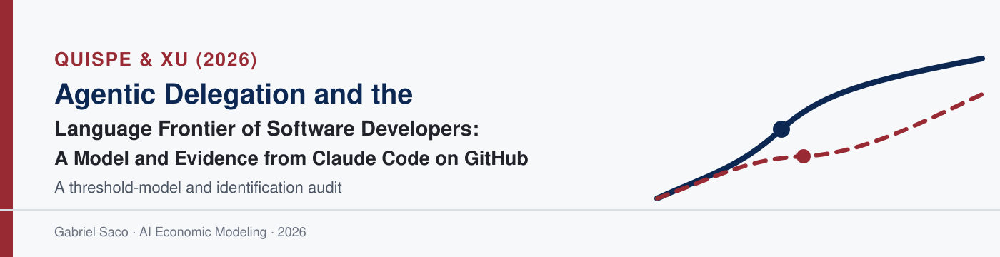

<p align="center">
  
</p>

<p align="center">
  <a href="https://arxiv.org/abs/2605.25438"></a>
  <a href="presentation.pdf"></a>
  <a href="extra/presentation-long.pdf"></a>
  <a href="lean/README.md"></a>
</p>

<p align="center">
  <a href="prompts.md"></a>
  
  
  
</p>

This repository studies Quispe and Xu's 2026 paper, *Agentic Delegation and the
Language Frontier of Software Developers: A Model and Evidence from Claude Code
on GitHub*.

## What question does the paper answer?

**Does agentic coding AI expand the set of programming languages in which a
developer can ship code?** The distinction between production and learning is
essential. Producing Rust with an agent expands a developer's production
frontier; it does not show that the developer has learned to write Rust alone.

The paper's proposed mechanism is delegation. Conversational AI offers advice
that is most useful when the developer already has a foothold in the language.
An agent adds a different production mode: the developer specifies and checks
the work while the tool executes it.

## The developer's problem

For every developer, language, and month, the developer compares the expected
surplus from the available production modes. Before adopting an agent, the menu
contains solo work and conversational assistance. After adoption, it also
contains delegation. A language becomes active only when the best available
mode covers the opportunity's execution, interaction, verification, computing,
and residual-error costs.

General programming ability matters under delegation because the developer
must describe the task, break it into pieces, inspect the output, and decide
whether the result is safe to ship. Language-specific skill matters most for
solo work and for making conversational suggestions useful.

## Main result, with all its conditions

For an unfamiliar language, the paper assumes that conversational assistance
cannot by itself make production worthwhile without a language-specific skill
foothold. Delegation expands the frontier only if it reduces the minimum-value
opportunity worth undertaking after accounting for verification, computing,
and residual-risk costs. Opportunities that were too marginal for solo work
but valuable enough under delegation then become newly feasible.

That conclusion needs all of the following conditions:

- conversational assistance does not overcome the unfamiliar-language entry barrier;
- delegated execution saves more than it costs to specify, verify, compute, and bear residual risk;
- relevant opportunities exist between the old and new entry thresholds;
- the developer has enough general ability to specify and verify the task;
- comparisons across specialists and generalists hold the pool of candidate unfamiliar languages fixed;
- the empirical comparison would have followed parallel trends without adoption;
- no contemporaneous project shock jointly triggers Claude adoption and language diversification.

The empirical application uses a public-GitHub panel of 5,346 sustained
adopters and later adopters. In the adoption month, Claude Code use is
associated with 2.53 additional active languages, 1.19 newly used languages,
and a 0.38 increase in language entropy. The strongest effects occur in the
adoption month and then shrink. “New” means unseen in the observed history
since January 2024, and adoption means the first public commit carrying
Claude's coauthor trailer.

These are event-time associations for public production. They are not direct
measures of learning, private work, code quality, or a settled causal effect.

## What does not hold up?

### The threshold mechanism is not uniquely agentic

The activation-band argument is a general threshold result. Any intervention
that lowers the entry threshold by the same amount can activate the same set of
marginal opportunities. Better libraries, a collaborator, a new job, or a
large ordinary productivity improvement could therefore produce the same
comparative static. The paper's distinctive agent mechanism comes from the
assumed differences among solo work, conversation, and delegation; it does not
follow from the threshold logic alone.

### The empirical design cannot separate expansion from selection

An unfamiliar-language project can both motivate a developer to adopt Claude
and directly increase the number of languages used. In that case, the adoption
month contains the true Claude effect plus the effect of selecting into
adoption when a new project arrives. A visible event-time jump can occur even
when Claude has no causal effect.

Flat earlier trends do not rule this out because the project can arrive in the
adoption month. Removing Claude-authored commits and deleting the first-Claude
language clean the measured outcome, but neither makes adoption timing
exogenous. The paper is appropriately cautious about this limitation. The
defensible verdict is therefore narrower: language-portfolio expansion
coincides with Claude Code adoption and is consistent with delegation, but the
design does not identify delegation as the cause.

The reproducible [`sim.py`](sim.py) simulation creates an estimated 1.83
adoption-month jump while setting Claude's true effect to zero.

## Relationship to the deskilling result

Aouad, Lykouris, and Zhong's *Human-AI Productivity Paradoxes: Modeling the
Interplay of Skill, Effort, and AI Assistance* also treats AI as a substitute
for human execution, but it allows lower human effort today to reduce future
skill. Quispe and Xu instead hold language skill fixed over the production
choice and ask whether delegation expands the feasible menu.

That single modeling choice explains the apparently opposite conclusions. A
fixed skill stock permits production-frontier expansion without learning;
effort-dependent skill creates a feedback from substitution to deskilling. The
comparison is developed on slide 4 of the presentation.

## Lean formalization

The complete generated EconCSLib paper folder is copied into
[`lean/`](lean/README.md). It was produced for `QX26AgenticDelegation` from the
pinned arXiv v2 source, not copied from the worked example. The generated
folder contains the paper-facing specifications, proof endpoints, assumptions,
audits, dependency graph, status record, and final validation report. Its
generated ignore rules keep paper PDFs, extracted source text, build caches,
and private review traces out of Git.

Five proposition targets have Lean proofs within their encoded scope. The most
important finding is a boundary error in Proposition 3: the paper's strict
growth claim fails when the first-use hazard is one, because the cumulative gap
jumps immediately and is flat afterward. The corrected Lean theorem requires
the hazard to be strictly below one, and a separate theorem verifies the
endpoint failure.

The submission is therefore labelled **partially formalized**, not fully
formalized. The activation-probability result uses an order-theoretic
abstraction of a cumulative distribution function, the empirical event-study
argument is outside Lean's scope, and the complete EconCSLib semantic-audit
closeout was not performed. The exact command and successful exit result are
recorded in [`formalization-check.md`](formalization-check.md); the detailed
scope report is in
[`lean/FINAL_VALIDATION_REPORT.md`](lean/FINAL_VALIDATION_REPORT.md).

## Presentations

| File | Purpose |
|---|---|
| [`presentation.pdf`](presentation.pdf) | Required 20-minute, 28-slide presentation |
| [`presentation.tex`](presentation.tex) | Main Beamer source |
| [`extra/presentation-long.pdf`](extra/presentation-long.pdf) | Extended-deck mirror |
| [`extra/presentation-long.tex`](extra/presentation-long.tex) | Extended-deck source |

## Handwritten check

The original photograph is stored in `hand/selection-derivation.png` and appears
on the final slide of the 20-minute deck. The repository preserves the
uncropped file; the Beamer source rotates it only for upright display.

## Repository structure

```text
.
├── README.md                         # Question, conditions, evidence, verdict
├── prompts.md                        # Raw relevant prompt-answer record
├── presentation.tex / .pdf          # Required 20-minute deck
├── extra/presentation-long.tex / .pdf
├── lean/                             # Exact generated EconCSLib paper folder
├── formalization-check.md            # Required paper-scoped check result
├── assets/                           # Banner and shared Beamer style
├── hand/                             # Original derivation photo goes here
├── figures/selection-counterexample.pdf
├── sim.py                            # Zero-effect selection counterexample
└── requirements.txt
```

## Reproduce

```bash
python3 -m pip install -r requirements.txt
python3 sim.py
lualatex presentation.tex
cd extra && lualatex presentation-long.tex
```

To reproduce the Lean result, use an EconCSLib checkout, place this repository's
`lean/` folder at `papers/QX26AgenticDelegation/`, and run the paper build and
paper-scoped check documented in [`formalization-check.md`](formalization-check.md).

## Citation

> Quispe, A., and Xu, K. 2026. *Agentic Delegation and the Language Frontier
> of Software Developers: A Model and Evidence from Claude Code on GitHub*.
> arXiv:2605.25438.
